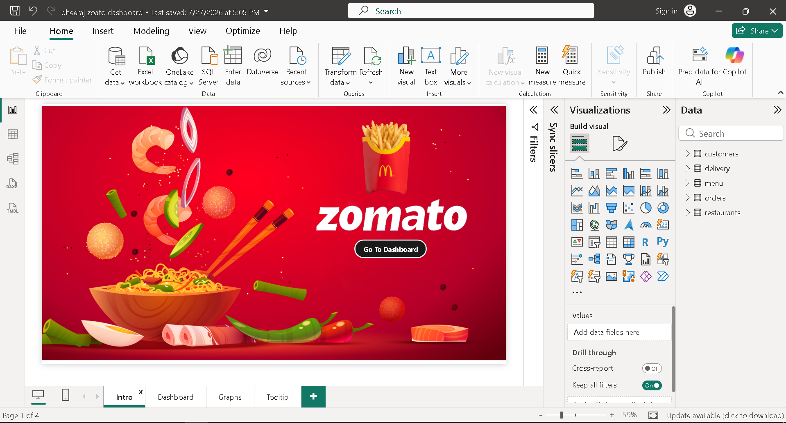
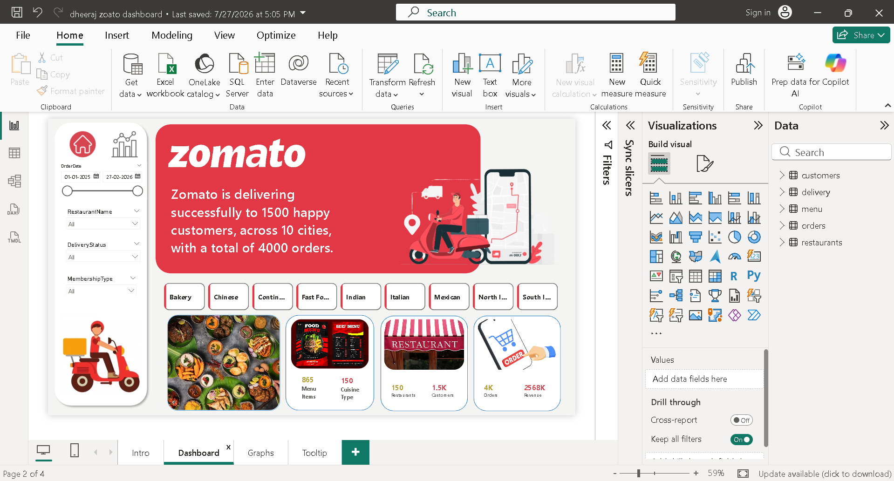
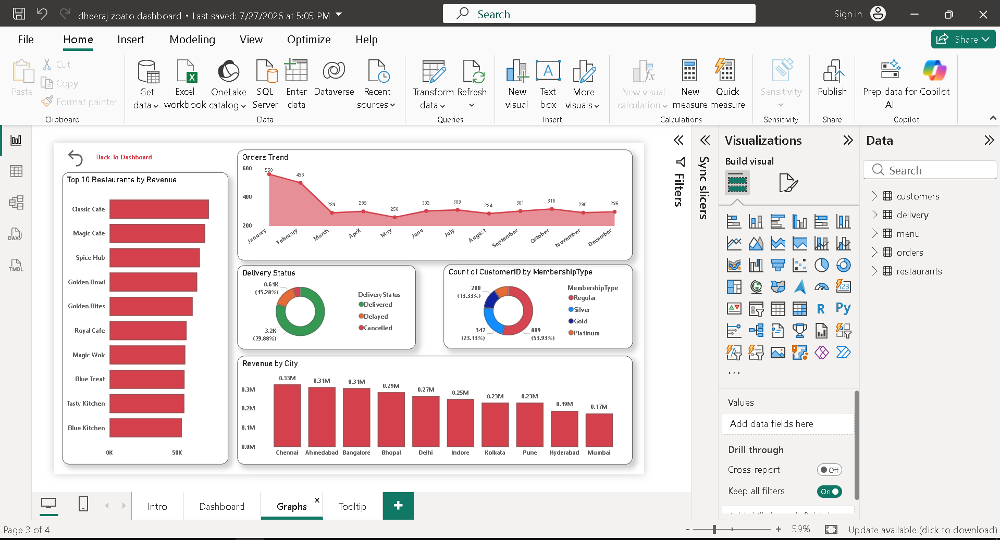
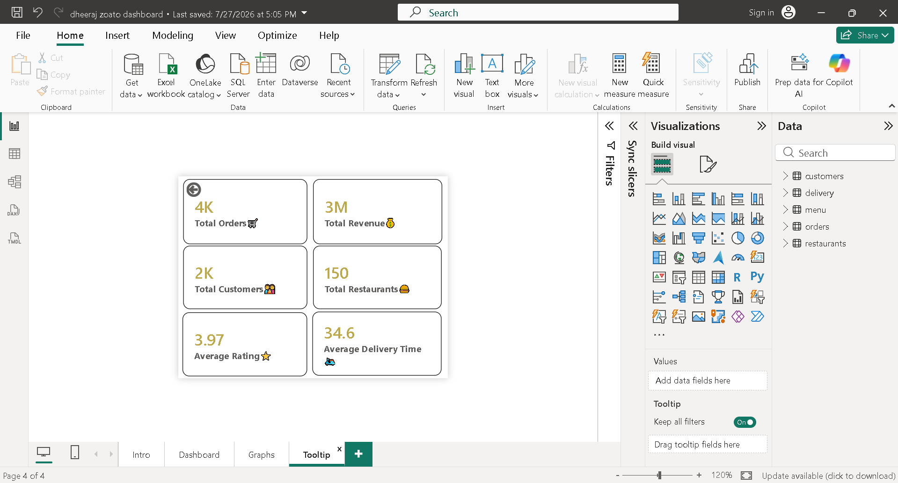

# 🍽️ Zomato Power BI Dashboard

## 📌 Project Overview

This project is an interactive Power BI Dashboard developed using Zomato restaurant data. The dashboard helps analyze restaurant performance, customer ratings, cuisines, online delivery, table booking, and other business insights.

---

## 🛠️ Tools Used

- Power BI
- Power Query
- DAX
- CSV Files

---

## 📊 Dashboard Features

- Executive Summary
- Restaurant Analysis
- Customer Rating Analysis
- Cuisine Analysis
- City-wise Analysis
- Online Delivery Analysis
- Interactive Slicers & Filters

---

## 📂 Dataset

The project uses 5 datasets (CSV files) for data modeling and analysis.

---

## 📈 Key KPIs

- Total Restaurants
- Average Rating
- Online Delivery %
- Table Booking %
- Total Cities
- Top Cuisine
- Cost Analysis

---

## 📷 Dashboard Preview

### Dashboard - Page 1

---

### Dashboard - Page 2

---

### Dashboard - Page 3

---

### Dashboard - Page 4

---

## 👨‍💻 Author

**Dheeraj Patidar**

- GitHub: https://github.com/DheerajPatidar875
- LinkedIn:https://www.linkedin.com/in/dheeraj-patidar-26a2213b8/
